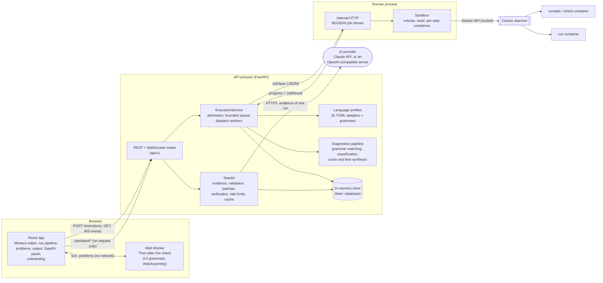
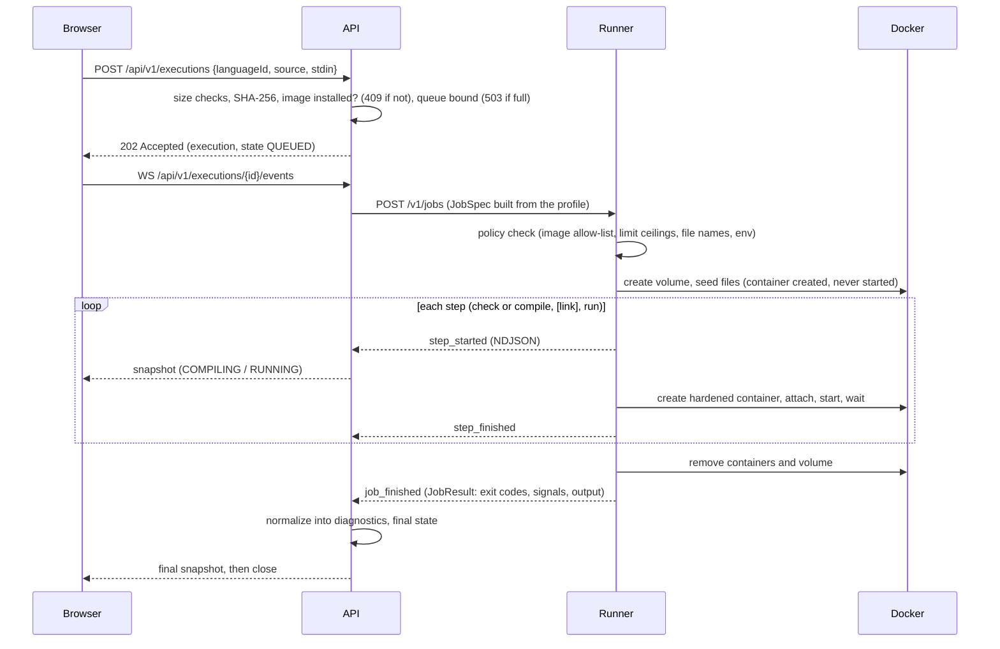
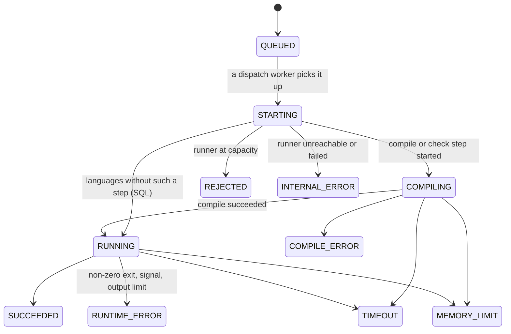

# Architecture

KAIRO is a browser IDE (React + Monaco), an API (FastAPI) that never
runs code, and a runner that is the only component allowed to use Docker. The
runner starts one hardened container per step (compile, run) from a sandbox
image per toolchain. Saarthi, the AI guide, lives inside the API and talks to
an AI provider only when a student asks.

## 1. Components

| Component | Code | Responsibility | Never does |
|---|---|---|---|
| Web app | `apps/web` | Editing, running, showing results, live check, Saarthi panel, onboarding. Compares the editor text's SHA-256 with the result's `sourceHash`. | Talk to the runner, Docker or the AI provider |
| Live check worker | `apps/web/src/live` | Parses the editor text with Tree-sitter 150 ms after the last keystroke and reports syntax problems | Send anything over the network |
| API | `services/api/app` | Validation, source snapshot and hash, admission control, jobs from profiles, normalizing results, state and events, Saarthi | Run student code, touch Docker |
| Language profiles | `services/api/app/adapters/profiles/*.toml`, `grammars/*.toml` | Everything language-specific: file name, argument arrays, limits, error grammars, classification rules, signal messages | Contain code |
| Saarthi | `services/api/app/ai` | Evidence from a stored run, prompts, provider calls, answer validation, patch checks, verification verdicts, rate limits and cache | Apply a change, or call anything "verified" without a run |
| Runner | `services/runner/runner` | Policy re-check, container lifecycle, limits, output caps, timeouts, cleanup, orphan reaper | Parse compiler output or know about languages |
| Sandbox images | `infra/containers/*` | Toolchains, unprivileged user 10001, no setuid binaries, toolchain metadata | — |
| Contracts | `packages/contracts` | OpenAPI, diagnostic schema and runner contract, generated from the models | — |

The API and the runner are separate processes on purpose: only the runner can
reach the Docker socket, and the runner does not know about languages, so a
new language never changes it (only its image allow-list).

## 2. Request flow: a run

## 3. Execution state machine

`CANCELLED` exists in the enum for user cancellation (not used yet). Each
change increments `execution.version`; WebSocket subscribers get the full
snapshot, so a client that misses a message still ends with the right state.

## 4. The sandbox

Per job the runner creates one named volume (the workspace) and one fresh
container per step. The source file is copied in through a container that is
created but never started, so no code runs during the copy.

| Control | Compile / check steps | Run step |
|---|---|---|
| Network | none | none |
| Root filesystem | read-only | read-only |
| Workspace `/workspace` | read-write (to write the program) | **read-only** |
| Writable scratch | `/tmp` tmpfs, noexec, size per profile | `/tmp` tmpfs, 16 MB, noexec (working directory) |
| User | 10001:10001, all capabilities dropped, `no-new-privileges` | same |
| Memory (swap off), PIDs, CPU time, wall clock | from the profile, within the runner's ceilings | same |
| Output (per stream) | 64 KB, then killed | 64 KB, then killed |
| Core dumps / open files | 0 / 256 | 0 / 256 |
| PID 1 | tini (`init=True`) | tini |
| Seccomp / AppArmor | Docker defaults | Docker defaults |
| Environment | only the profile's variables; `LD_*`/`DYLD_*` refused by policy | same |

Per-language limits are listed in [languages.md](languages.md). The runner
refuses anything above its own ceilings (`RUNNER_MAX_*`: 60 s wall, 60 s CPU,
1024 MB, 256 PIDs per step). Output is read through an attach socket opened
before the container starts, so nothing is lost and nothing is written to disk
(the log driver is `none`). All containers and the volume are removed in
`finally` blocks; a reaper removes labelled leftovers older than 5 minutes.
[threat-model.md](threat-model.md) lists what this does and does not protect
against, with the per-language test results.

## 5. Diagnostics

1. **Grammar matching:** each line of a step's output is matched against the
   language's ordered rules (`grammars/*.toml`). A line starts a diagnostic,
   adds a detail or a related location to the previous one, sets context, or is
   known noise such as source excerpts and caret lines. Block parsers read
   multi-line reports: Python tracebacks, JVM and .NET exceptions with their
   stack traces, rustc's multi-line errors, Rust and Go panics, C++
   `terminate` messages, and Node.js, PHP, Ruby, Lua and SQLite errors; the
   frame that belongs to the student's file gives the line. Unknown lines
   become one `UNPARSED` info diagnostic pointing at the raw output, never
   dropped silently.
2. **Classification:** ordered rules map the message to a category and a
   stable code with the language's prefix (`C_MISSING_SEMICOLON`,
   `PY_NAME_ERROR`, `TS_TYPE_MISMATCH`...). Unmatched messages get the
   language's generic compiler error or warning code.
3. **Deterministic hints:** a rule may add a related location. For "expected
   ';' before X" at the first token of a line, it points at the end of the
   previous line, where the `;` is usually missing.
4. **Synthesis:** crashes and limits that print nothing (SIGSEGV, SIGFPE,
   SIGABRT, SIGILL, SIGTRAP, timeouts, memory and output limits, non-zero
   exits) produce neutral diagnostics such as `RUNTIME_SEGMENTATION_FAULT` or
   `LIMIT_TIMEOUT`, so a crash never looks like success. A profile can give a
   signal a language-specific message (Swift traps).
5. **Positions:** lines are 1-based. Columns are 1-based UTF-16 code units, as
   in Monaco and LSP; tools that report bytes or code points are converted
   using the exact source snapshot. Ranges are end-exclusive.
6. **Duplicates** (a message printed twice, or as a warning and then an
   error) are merged, keeping the higher severity.

## 6. Stale results

The API stores `sourceHash = "sha256:" + SHA-256(UTF-8 source)` with every
execution. The browser hashes the editor text the same way. If the hashes
differ, the editor hides the result's markers, the problems panel shows "You
changed the code after this run" and Saarthi asks for a new run instead of
answering about old code. Undoing back to the exact compiled text makes the
results current again. Saarthi's fixes carry the hash of the code they were
made for and are refused for any other text.

## 7. Live check while typing

`apps/web/src/live`: the editor text goes to a module Web Worker 150 ms after
the last change, with a generation number. The worker keeps one Tree-sitter
parser per language (grammars are bundled `.wasm` files loaded on first use),
parses, and turns ERROR and MISSING nodes into short plain-language problems
(`analyze.ts`). Answers for an older generation are dropped, and problems are
only shown while the editor still holds exactly the text they were computed
for. For Python, `analyze.ts` adds the rules the grammar does not enforce
(missing `:`, CPython's indentation rules, empty blocks, `print "x"`); for
Ruby, Lua and Bash, rules for `then`/`do`/`end`/`fi`/`done`. Problems appear as
yellow squiggles and in a "Live syntax check (not run yet)" box; the compiler's
results after a run replace them. Nothing is sent to the server.

## 8. Saarthi

See [saarthi.md](saarthi.md) for the full design. In short: explain, fix and
ask requests name a stored execution and the editor's source hash; the server
builds the evidence (numbered source, diagnostics, output) itself, calls the
provider with a strict answer schema, validates the answer and, for fixes,
checks the patch against the snapshot. Verification runs the patched code
through the normal execution path and compares the two runs; the model is
never asked whether its own fix worked.

## 9. Where the synopsis algorithms live

| Algorithm | Status | Where |
|---|---|---|
| A1 incremental syntax analysis | **Done**: Tree-sitter in a Web Worker, 14 languages | `apps/web/src/live` |
| A2 debounced two-speed scheduler | **Done**: 150 ms live check on every edit, full compile on Run; generation numbers drop stale answers | `apps/web/src/live/useLiveCheck.ts`, `App.tsx` |
| A3 diagnostic normalization | **Done** for 32 languages (+ Swift, unverified) | `services/api/app/analysis/`, `adapters/grammars/` |
| A4 fault classification | **Done** for 32 languages | `services/api/app/analysis/classify.py`, profiles |
| A5 evidence selection | **Done** (first form): focus diagnostic, windows around relevant lines, bounded output | `services/api/app/ai/context.py` |
| A6 binding-site backtracking | Partly: deterministic "missing ';' belongs on the line before" hints and related locations | grammars |
| A7 response validation | **Done**: schema, lengths, line range, source hash, patch applies to the snapshot, patch size policy | `services/api/app/ai/service.py` |
| A8 differential verification | **Done**: `fixed` / `improved` / `not_fixed` / `different_code` from a real run | `AssistantService.verify` |
| A9 confidence scoring | Model-reported (`low`/`medium`/`high`), shown with the answer; a deterministic score is future work | `services/api/app/ai` |
| A10 mutation seeding | Future work (evaluation corpus) | — |
| A11 admission control | **Basic form**: global queue bound + W dispatch workers + runner capacity | `services/api/app/services/executions.py`, `services/runner/runner/app.py` |
| A12 to A14 rate limits, priorities, cache | **Done for Saarthi**: per-client and global limits, concurrency cap, answer cache | `services/api/app/ai/service.py` |
| A15 circuit breaker | Future work | — |

## 10. Design decisions

| Decision | Why | Revisit when |
|---|---|---|
| One container **per step** (not one container with `docker exec`) | Docker itself reports the exit status and the OOM flag of PID 1; the program cannot forge them. The run step gets a read-only workspace. | Container start-up time dominates (about 0.1 to 0.3 s per step here) |
| Declarative TOML profiles, grammars in separate files | "Add a language by configuration"; regexes in TOML literal strings need no escaping; profiles share grammars where tools share formats (C# and TypeScript compilers, the Node.js runtime for JavaScript and TypeScript, the JVM runtime for Java and Kotlin) | A language needs logic that rules and block parsers cannot express |
| A check step for interpreted languages | Syntax errors become compile errors with a line, and the program never starts | — |
| Runner behind internal HTTP + NDJSON, not Redis | One lab machine; fewer moving parts; progress events for free | Several runner machines are needed |
| In-memory execution store | No accounts or projects yet | Persistence (planned with Supabase/Postgres) |
| WebSocket sends full snapshots | Simple client logic; no lost-update bugs | Output streaming (large payloads) |
| Monaco and Tree-sitter bundled locally, lazy-loaded | Works offline in a lab; first paint does not wait for them | — |
| Editor owns its text while typing | The web app replaces the editor's text only for deliberate changes (examples, fixes, language switch); comparing values on every render lost keystrokes during fast typing | — |
| Language availability from the runner | A language whose image is not built is hidden instead of failing at Run (and the API answers 409) | — |
| Saarthi on the server, grounded in stored runs | Keys never reach the browser; answers can only use evidence the platform produced; one place for limits and cache | — |
| Verification by running, not by asking | A model's opinion about its own fix is not evidence | — |
| No peak-memory figure | Unreliable after exit on cgroup v1/v2 without a supervisor; a wrong number is worse than none | Measure via cgroup v2 `memory.peak` in a runner-managed parent cgroup |

## 11. Known limitations

* Single-file programs only (one `main.<ext>`; Java's `Main.java`), no
  third-party packages, no network inside programs.
* One API process with in-memory state: restarting it forgets executions and
  Saarthi's pending fixes.
* No accounts: an execution id (96 random bits) is the only thing needed to
  read a result, and rate limits are per IP address. Keep the API on a
  trusted network until accounts exist.
* Runtime crashes that print nothing (a segmentation fault in C) have no
  source line; sanitizer builds as an opt-in "debug run" are an option.
* The runner needs a Linux Docker daemon: on Windows use Docker Desktop with
  WSL 2, or GitHub Codespaces ([codespaces.md](codespaces.md)).
